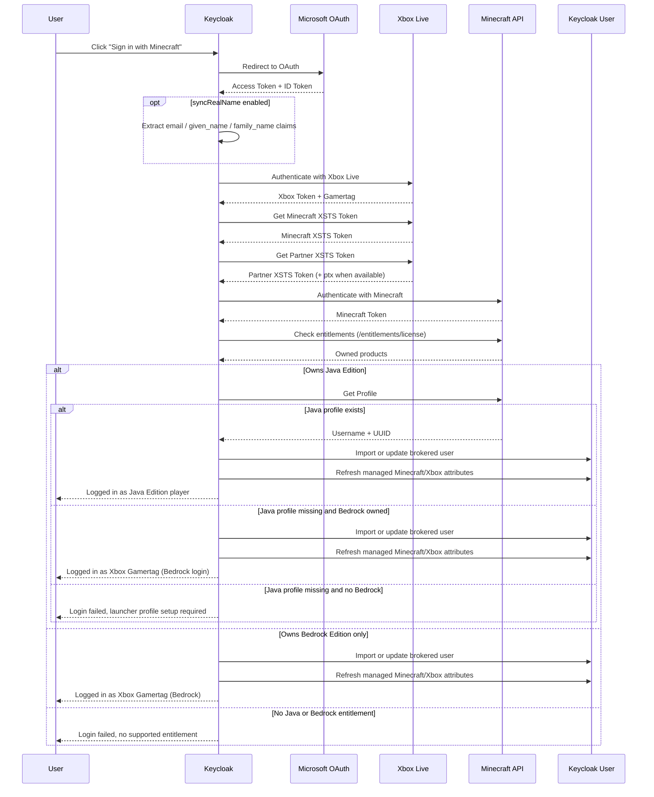

# Keycloak Minecraft Identity Provider (keycloak-minecraft-idp)

A Keycloak Identity Provider plugin that enables authentication via Microsoft/Xbox OAuth2 and resolves the brokered login identity to the Minecraft Java player name when a Java profile exists, otherwise to the Xbox Gamertag for supported Bedrock logins.

## Features

- **Minecraft Java Edition Support** – Authenticate players with their Minecraft Java Edition account
- **Bedrock Edition Support** – Players with Bedrock entitlement can log in with their Xbox Gamertag
- **Resolved Login Name** – Uses the Minecraft Java player name when available, otherwise the Xbox Gamertag
- **Stable Account Linking** – Uses the Xbox partner `ptx` claim for brokered account linking
- **Rich User Attributes** – Stores Minecraft UUID, edition type, and best-effort Xbox Gamertag
- **Seamless Integration** – Works like any other Keycloak Identity Provider

## Quick Start

### Download

Download the published package from GitHub Packages:

- Repository: `https://maven.pkg.github.com/groundsgg/keycloak-minecraft-idp`
- Artifact: `gg.grounds:keycloak-minecraft-idp:<version>`

Or build from source:

```bash
./gradlew shadowJar
```

### Installation

1. Copy the JAR to your Keycloak providers directory:

```bash
cp keycloak-minecraft-idp.jar /opt/keycloak/providers/
```

2. Rebuild Keycloak:

```bash
/opt/keycloak/bin/kc.sh build
```

3. Restart Keycloak

## How It Works



## Prerequisites

- JDK 21 installed locally and available on `PATH`
- A Microsoft Azure App Registration

Gradle toolchain auto-download is disabled in this repository. Builds require a locally installed JDK 21 and will not provision one automatically.

### Azure App Registration

You need a Microsoft Azure App Registration:

1. Go to [Azure Portal](https://portal.azure.com/) → "App registrations"
2. Create a new App Registration
3. Configure:
   - **Redirect URI**: `https://your-keycloak-url/realms/{realm}/broker/minecraft/endpoint`
   - **API Permissions**: Add `XboxLive.signin` (delegated)
4. Create a Client Secret under "Certificates & secrets"

### Minecraft API Whitelisting

Minecraft authentication integrations may also require Mojang/Minecraft API whitelisting, depending
on how your application is registered and used. Check the official Minecraft help article before
deployment:

- https://help.minecraft.net/hc/en-us/articles/16254801392141

If your application has not been whitelisted for the relevant Minecraft services APIs, authentication
or entitlement checks may fail even when the Microsoft OAuth setup is otherwise correct.

## Configuration in Keycloak

1. Go to your Realm → Identity Providers
2. Click "Add provider" → "Minecraft"
3. Configure:
   - **Client ID**: The Application (client) ID from your Azure App
   - **Client Secret**: The Client Secret from your Azure App
   - **Partner Relying Party**: The Xbox partner relying party that returns the `ptx` claim
   - **Partner XSTS Private Key**: Optional PEM, `file:`, or `vault:` reference used when the
     partner token is encrypted and `ptx` is not exposed in `DisplayClaims`

This provider supports only the OAuth client authentication method `client_secret_post`.
Do not enable Basic or JWT-based client authentication modes for this identity provider.

### Required Xbox Partner Setup

Stable brokered account linking uses the Xbox partner `ptx` claim. The provider requests a second
partner XSTS token in addition to the Minecraft XSTS token, so your Microsoft/Xbox setup must
include a partner relying party that returns `ptx`.

Without that partner relying party, login fails.

Some partner relying parties return `ptx` only inside the encrypted XSTS token payload instead of
`DisplayClaims`. In that case, configure **Partner XSTS Private Key** with the matching private
key so the provider can decrypt the partner token and recover `ptx`.

Example values:

- Raw PEM content
- `file:/opt/keycloak/conf/xsts-private.pem`
- `/opt/keycloak/conf/xsts-private.pem`
- `vault:keycloak/minecraft-partner-xsts-private-key`

### Optional Server-Level Credentials

Instead of storing the Microsoft client credentials in the realm database, you can provide them at the Keycloak server level:

- `KC_SPI_IDENTITY_PROVIDER_MINECRAFT_CLIENT_ID`
- `KC_SPI_IDENTITY_PROVIDER_MINECRAFT_CLIENT_SECRET`
- `KC_SPI_IDENTITY_PROVIDER_MINECRAFT_PARTNER_XSTS_PRIVATE_KEY`

Or with `kc.sh` flags:

- `--spi-identity-provider-minecraft-client-id=<value>`
- `--spi-identity-provider-minecraft-client-secret=<value>`
- `--spi-identity-provider-minecraft-partner-xsts-private-key=<value>`

When both server-level credentials are configured, the **Client ID** and **Client Secret** fields in the Keycloak admin UI may be left empty.

If both are set, values entered in the Keycloak admin UI take precedence over the server-level defaults.

The server-level secret is compatible with this provider's supported `client_secret_post` flow and may also be provided as a `vault:` reference.

### Vault-Backed Secrets

The configured **Client Secret** and **Partner XSTS Private Key** may reference a Keycloak vault
entry by using the `vault:` prefix.

Example:

```text
vault:keycloak/minecraft
```

The provider resolves the configured value through the Keycloak vault before using it. Blank or
unresolved vault values are rejected.

## User Attributes

After successful authentication, the provider stores and refreshes the following managed custom attributes on the Keycloak user during brokered logins:

| Attribute                  | Description                                                  |
|----------------------------|--------------------------------------------------------------|
| `microsoft_name`           | The raw Microsoft OIDC `name` claim when available           |
| `minecraft_login_identity` | `java` or `bedrock` - which identity was used for login      |
| `minecraft_java_owned`     | `true` or `false` - whether Java entitlement was detected    |
| `minecraft_bedrock_owned`  | `true` or `false` - whether Bedrock entitlement was detected |
| `minecraft_java_uuid`      | The Minecraft UUID (only when logging in as Java)            |
| `minecraft_java_username`  | The Minecraft Java username (only when logging in as Java)   |
| `xbox_gamertag`            | The player's Xbox Gamertag (best effort, when available)     |

The brokered identity itself uses the resolved Minecraft Java username or Xbox Gamertag as its
`username`. On initial user import, that becomes the Keycloak username. Existing users always get
the managed custom attributes above refreshed on login. When **Sync Real Name** is enabled, the
provider also refreshes the raw `microsoft_name` attribute and, when Microsoft provides
`given_name` and `family_name`, synchronizes the core Keycloak `firstName` and `lastName` fields
according to the identity provider sync mode. The current implementation does not force-update the
core Keycloak `username` field on every subsequent login.

Internally, brokered account linking uses the Xbox partner `ptx` claim from the configured partner
XSTS token. Microsoft documents `ptx` (Partner XUID / pXUID) as the recommended identifier for
account-linking and single sign-on scenarios because it is unique per publisher, while the XSTS
user hash (`uhs`) is not guaranteed to remain stable across future tokens. The Minecraft XSTS
token is still used only for Minecraft authentication.

References:

- https://learn.microsoft.com/en-us/gaming/gdk/docs/services/fundamentals/s2s-auth-calls/service-authentication/live-title-service-authentication
- https://learn.microsoft.com/en-us/gaming/gdk/docs/services/fundamentals/s2s-auth-calls/service-authentication/security-tokens/live-security-tokens
- https://learn.microsoft.com/en-us/gaming/gdk/docs/services/fundamentals/s2s-auth-calls/service-authentication/security-tokens/live-token-claims

### Java Edition vs. Bedrock Edition

- **Java Edition**: Players with Java entitlement and a Java profile get their Java player name and UUID
- **Bedrock Edition**: Players with Bedrock entitlement can log in with their Xbox Gamertag

The provider resolves login identity with these rules:

- If the account owns Java Edition and a Java profile exists, login uses the Java username and UUID.
- If the account owns Bedrock Edition but not Java Edition, login uses the Xbox Gamertag.
- If the account owns Java Edition but no Java profile exists yet, login uses the Xbox Gamertag only when Bedrock entitlement is also present.
- If the account owns Java Edition without a Java profile and does not own Bedrock, login fails and the user must create the Java profile through the Minecraft Launcher first.
- If the account owns neither Java nor Bedrock, login fails.

The ownership flags and the login identity are intentionally separate:

- `minecraft_java_owned` and `minecraft_bedrock_owned` describe what the account owns
- `minecraft_login_identity` describes which identity path was used for this login

## Local Development

```bash
# Verify Java 21 is installed
java -version

# Build the provider JAR
./gradlew shadowJar

# Start Keycloak with the development compose file
cd docker
docker compose up -d
```

`java -version` must report Java 21 before running the Gradle build.

The development compose file mounts `../build/libs/keycloak-minecraft-idp.jar` into the upstream Keycloak image and runs `kc.sh build` before `start-dev`.

Keycloak will be available at http://localhost:8080.
- **Admin Username**: admin
- **Admin Password**: admin

## Troubleshooting

### "This Microsoft account does not own Minecraft"

If the user does not own Java Edition but does own Bedrock Edition, they will still be authenticated with their Xbox Gamertag.

If the account owns Java Edition but has not created a Java profile yet, the provider uses the Xbox Gamertag only when Bedrock entitlement is also present.

If the account owns neither Java nor Bedrock, authentication fails.

### Xbox Live Errors

| Error Code   | Meaning                                          |
|--------------|--------------------------------------------------|
| 2148916227   | Account banned from Xbox Live                    |
| 2148916233   | Microsoft account doesn't have an Xbox account   |
| 2148916235   | Xbox Live is not available in the user's country |
| 2148916236/7 | Adult verification required (South Korea)        |
| 2148916238   | Child account - needs to be added to a family    |

## Acknowledgments

- [Keycloak](https://www.keycloak.org/) – Open Source Identity and Access Management
- [Minecraft Authentication Documentation](https://minecraft.wiki/w/Microsoft_authentication) – Community documentation of the auth flow
