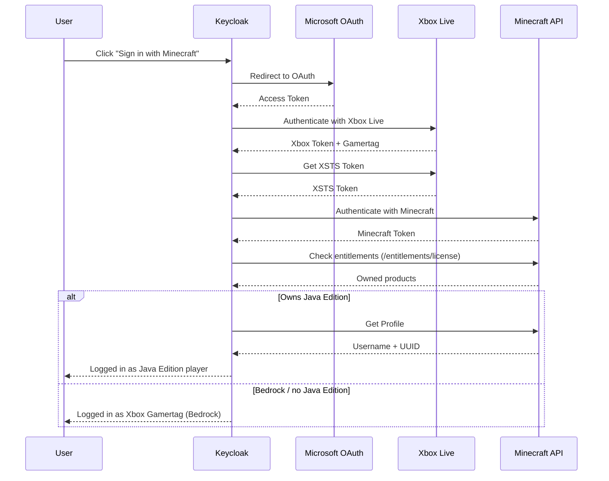

# Keycloak Minecraft Identity Provider (keycloak-minecraft-idp)

A Keycloak Identity Provider plugin that enables authentication via Microsoft/Xbox OAuth2 and uses the Minecraft Java player name when available, otherwise the Xbox Gamertag, as the primary username.

## Features

- **Minecraft Java Edition Support** – Authenticate players with their Minecraft Java Edition account
- **Bedrock Edition Fallback** – Players without Java Edition can use their Xbox Gamertag
- **Automatic Username Sync** – Keycloak username is automatically set to the Minecraft player name
- **Rich User Attributes** – Stores Minecraft UUID, edition type, and Xbox Gamertag
- **Seamless Integration** – Works like any other Keycloak Identity Provider

## Quick Start

### Download

Download the latest JAR from the [Releases](https://github.com/groundsgg/keycloak-minecraft-idp/releases) page.

Or build from source:

```bash
./gradlew shadowJar
```

### Installation

1. Copy the JAR to your Keycloak providers directory:

```bash
cp keycloak-minecraft-idp.jar /opt/keycloak/providers/
```

2. Rebuild Keycloak:

```bash
/opt/keycloak/bin/kc.sh build
```

3. Restart Keycloak

## How It Works



## Prerequisites

- JDK 21 installed locally and available on `PATH`
- A Microsoft Azure App Registration

Gradle toolchain auto-download is disabled in this repository. Builds require a locally installed JDK 21 and will not provision one automatically.

### Azure App Registration

You need a Microsoft Azure App Registration:

1. Go to [Azure Portal](https://portal.azure.com/) → "App registrations"
2. Create a new App Registration
3. Configure:
   - **Redirect URI**: `https://your-keycloak-url/realms/{realm}/broker/minecraft/endpoint`
   - **API Permissions**: Add `XboxLive.signin` (delegated)
4. Create a Client Secret under "Certificates & secrets"

## Configuration in Keycloak

1. Go to your Realm → Identity Providers
2. Click "Add provider" → "Minecraft"
3. Configure:
   - **Client ID**: The Application (client) ID from your Azure App
   - **Client Secret**: The Client Secret from your Azure App

This provider supports only the OAuth client authentication method `client_secret_post`.
Do not enable Basic or JWT-based client authentication modes for this identity provider.

### Optional Server-Level Credentials

Instead of storing the Microsoft client credentials in the realm database, you can provide them at the Keycloak server level:

- `KC_SPI_IDENTITY_PROVIDER_MINECRAFT_CLIENT_ID`
- `KC_SPI_IDENTITY_PROVIDER_MINECRAFT_CLIENT_SECRET`

Or with `kc.sh` flags:

- `--spi-identity-provider-minecraft-client-id=<value>`
- `--spi-identity-provider-minecraft-client-secret=<value>`

When these server-level values are configured, the **Client ID** and **Client Secret** fields in the Keycloak admin UI may be left empty.

If both are set, values entered in the Keycloak admin UI take precedence over the server-level defaults.

The server-level secret is compatible with this provider's supported `client_secret_post` flow.

## User Attributes

After successful authentication, the following attributes are stored:

| Attribute                  | Description                                                  |
|----------------------------|--------------------------------------------------------------|
| `username`                 | Primary Keycloak username: Java player name or Xbox Gamertag |
| `minecraft_login_identity` | `java` or `bedrock` - which identity was used for login      |
| `minecraft_java_owned`     | `true` or `false` - whether Java entitlement was detected    |
| `minecraft_bedrock_owned`  | `true` or `false` - whether Bedrock entitlement was detected |
| `minecraft_java_uuid`      | The Minecraft UUID (only when logging in as Java)            |
| `minecraft_java_username`  | The Minecraft Java username (only when logging in as Java)   |
| `xbox_gamertag`            | The player's Xbox Gamertag                                   |
| `xbox_user_id`             | The Xbox User ID (if available)                              |

### Java Edition vs. Bedrock Edition

- **Java Edition**: Players with Java entitlement and a Java profile get their Java player name and UUID
- **Bedrock Edition**: Players with Bedrock entitlement can log in with their Xbox Gamertag

If a player owns both editions, the plugin prefers `java` as the login identity when a Java profile exists. If Java is owned but no Java profile exists yet, the plugin falls back to `bedrock` only when a Bedrock entitlement is also present.

The ownership flags and the login identity are intentionally separate:

- `minecraft_java_owned` and `minecraft_bedrock_owned` describe what the account owns
- `minecraft_login_identity` describes which identity path was used for this login

## Local Development

```bash
# Verify Java 21 is installed
java -version

# Build the provider JAR
./gradlew shadowJar

# Start Keycloak with the development compose file
cd docker
docker compose up -d
```

`java -version` must report Java 21 before running the Gradle build.

The development compose file mounts `../build/libs/keycloak-minecraft-idp.jar` into the upstream Keycloak image and runs `kc.sh build` before `start-dev`.

Keycloak will be available at http://localhost:8080.
- **Admin Username**: admin
- **Admin Password**: admin

## Troubleshooting

### "This Microsoft account does not own Minecraft Java Edition"

If the user does not own Java Edition but does own Bedrock Edition, they will be authenticated with their Xbox Gamertag instead.

If the account owns neither Java nor Bedrock, authentication fails.

### Xbox Live Errors

| Error Code   | Meaning                                          |
|--------------|--------------------------------------------------|
| 2148916227   | Account banned from Xbox Live                    |
| 2148916233   | Microsoft account doesn't have an Xbox account   |
| 2148916235   | Xbox Live is not available in the user's country |
| 2148916236/7 | Adult verification required (South Korea)        |
| 2148916238   | Child account - needs to be added to a family    |

## Contributing

Contributions are welcome! Please feel free to submit a Pull Request.

1. Fork the repository
2. Create your feature branch (`git checkout -b feature/amazing-feature`)
3. Commit your changes (`git commit -m 'Add some amazing feature'`)
4. Push to the branch (`git push origin feature/amazing-feature`)
5. Open a Pull Request

## Acknowledgments

- [Keycloak](https://www.keycloak.org/) – Open Source Identity and Access Management
- [Minecraft Authentication Documentation](https://minecraft.wiki/w/Microsoft_authentication) – Community documentation of the auth flow
